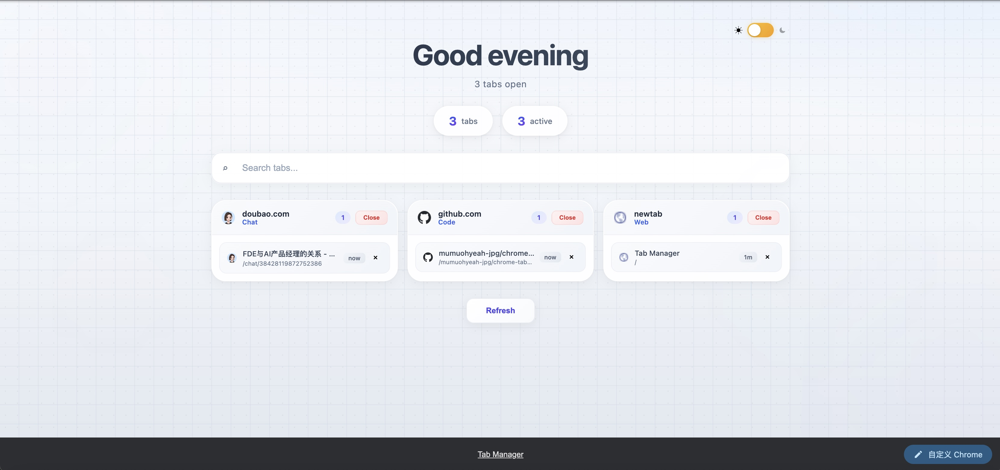
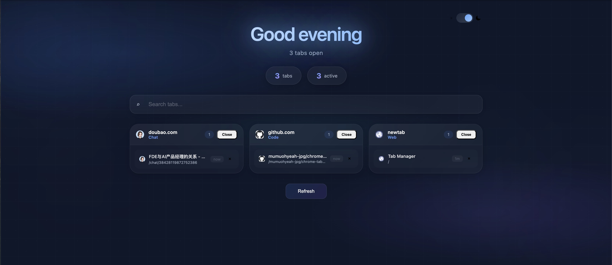

# Tab Manager

A Chrome extension that replaces your new tab page with a clean, domain-grouped tab manager. Supports smart categorization, light/dark theme, and quick search.

一个用简洁的域名分组标签管理器替代新标签页的 Chrome 扩展。支持智能分类、深色/浅色主题和快速搜索。

---

## Screenshots / 截图

### Light Mode / 浅色模式


### Dark Mode / 深色模式


---

## Features / 功能

- **Domain grouping** — Tabs are automatically grouped by domain for a clean overview
- **Smart categorization** — Automatically detects what each tab is about (Code, AI, Design, Video, Social, Shopping, etc.)
- **Light/Dark theme** — Auto-switches based on time of day, with manual toggle
- **Tab search** — Quickly find tabs by title or URL
- **Batch close** — Close all tabs from a domain with one click
- **Time tracking** — See how long each tab has been open
- **Greeting** — Time-based greeting with tab count

---

## Installation / 安装

### Option 1: Download ZIP (Recommended / 推荐)

1. Click the green **Code** button at the top of this page, then click **Download ZIP**
2. Unzip the downloaded file to a folder on your computer
3. Open Chrome and go to `chrome://extensions/`
4. Turn on **Developer mode** (toggle in the top-right corner)
5. Click **Load unpacked** and select the unzipped folder
6. The extension is now active — open a new tab to see it in action

### Option 2: Clone with Git / 使用 Git 克隆

```bash
git clone https://github.com/mumuohyeah-jpg/chrome-tab-manager.git
```

Then follow steps 3-6 from Option 1 above.

### After installation / 安装后

Open a new tab (`Cmd+T` / `Ctrl+T`) and you should see the Tab Manager interface instead of Chrome's default new tab page.

打开一个新标签页 (`Cmd+T` / `Ctrl+T`)，你应该会看到 Tab Manager 界面而不是 Chrome 默认的新标签页。

---

## Usage / 使用指南

### View your tabs / 查看标签页

When you open a new tab, all your current tabs are displayed, **grouped by domain** (e.g., all `github.com` tabs together). Each group shows:

- **Domain name** and a **category label** (e.g., "Code", "AI", "Design")
- The **number of tabs** in that group
- Each tab's title, path, and how long it's been open

### Search tabs / 搜索标签页

Type in the search box at the top to filter tabs by **title or URL**. The list updates as you type.

在顶部的搜索框中输入关键词，可以按**标题或 URL** 过滤标签页。列表会随着输入实时更新。

### Close tabs / 关闭标签页

- **Close a single tab** — Click the **×** button on the right side of any tab
- **Close all tabs from a domain** — Click the **Close** button in the domain header. A confirmation dialog will appear.

- **关闭单个标签页** — 点击标签页右侧的 **×** 按钮
- **关闭整个域名的所有标签页** — 点击域名标题栏的 **Close** 按钮，会弹出确认对话框

### Switch theme / 切换主题

The theme **auto-switches** based on time of day:
- **Light mode** during daytime (6:00 AM – 6:00 PM)
- **Dark mode** at night (6:00 PM – 6:00 AM)

You can also manually toggle the theme by clicking the **sun/moon switch** in the top-right corner.

主题会根据时间**自动切换**：
- **浅色模式** 白天（早上 6:00 – 下午 6:00）
- **深色模式** 夜间（下午 6:00 – 早上 6:00）

你也可以点击右上角的**太阳/月亮开关**手动切换主题。

### Refresh / 刷新

The tab list **auto-refreshes every 30 seconds**. You can also click the **Refresh** button at the bottom to update immediately.

标签页列表会**每 30 秒自动刷新**。你也可以点击底部的 **Refresh** 按钮立即更新。

---

## Permissions / 权限

| Permission | Reason |
|-----------|--------|
| `tabs` | Read and close tabs for grouping and management |

Only the `tabs` permission is required — no data is collected or sent anywhere.

该扩展仅需要 `tabs` 权限 — 不会收集或发送任何数据。

---

## Project Structure / 项目结构

```
chrome-tab-manager/
├── manifest.json       # Extension config / 扩展配置
├── background.js       # Service worker — tracks tab lifecycle
├── newtab.html         # New tab page layout / 新标签页布局
├── newtab.js           # New tab page logic / 新标签页逻辑
├── newtab.css          # New tab page styles / 新标签页样式
├── icon.svg            # Vector icon / 矢量图标
├── icon16.png          # Icon 16x16
├── icon48.png          # Icon 48x48
└── icon128.png         # Icon 128x128
```

## License

MIT
